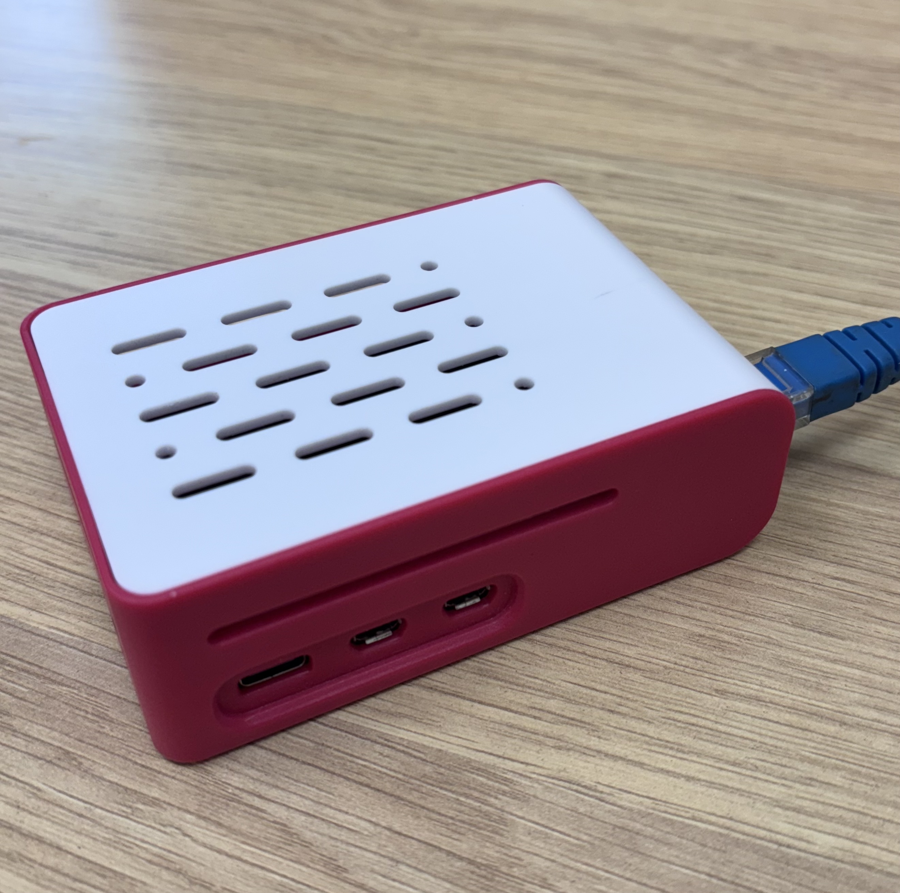

# AquaTroll Logger Data Pipeline
!(images/gorgeMonitoring.jpg)
## Project Overview

The industry standard for collecting surface pool depth readings largely relies on pressure-based logger data, which requires regular calibration to remain accurate. In areas with challenging terrain and anthropological sensitivities, infrequent site access leads to unreliable data and delayed identification of issues. This situation makes it impossible to reliably deliver the best possible environmental outcomes.

Off-the-shelf telemetry systems were either too bulky, too power-hungry, or lacked the connectivity required to operate in steep gorges of the project environment. To overcome this, [Maxy Engineering](https://maxyengineering.com.au/) developed a highly portable, power-independent logging system capable of transmitting data via 4G/5G or the Iridium satellite network—eliminating the need for regular site visits.

This project links Maxy’s hardware with a software system that automates data collection, pressure calibration, and alerting. Daily calibrations are performed using external weather data, and the system flags anomalies for review—enabling timely corrective actions. Results are emailed to the site environmental team and loaded into the company’s environmental data storage system. The full pipeline runs autonomously on a Raspberry Pi, providing reliable, continuous monitoring with no manual data handling.

## Hardware Components

| Remote Logger | Raspberry Pi Setup |
|----------------|--------------------|
|  |  |

> 📩 *To discuss the most suitable setup for your location, contact Maxy Engineering at*  
> ✉️ **office@MAXYEngineering.com.au**  
> 📞 **0478 221 776**

## How it Works

The main script, `runPipeline.py`, orchestrates the following steps:

1.  **Scraping Logger Data (`loggerScraper.py`):** Uses Playwright to automate a web browser and download raw level and barometric pressure CSV files into the `data_downloads/` directory. Merges these two files for each location.
2.  **Scraping Weather Data (`weatherStation.py`):** Uses a GET Request and BeautifulSoup to scrape weather website for daily barometric pressure readings.
3.  **Data Validation & Calibration (`dataValidation.py`):**
    *   Reads CSVs from `data_downloads/`.
    *   Cleans and validates the data (Coverts types. Also handles erroneous and missing values).
    *   Retrieves external barometric data (by calling `weatherStation.py`).
    *   Merges external weather data with the logger data based on date.
    *   Calculates an 'adjusted depth' by comparing barometer data from the logger's internal sensor and the  external weather station. Uses In-Situ's formula specific to the AquaTroll sensors.
    *   Consolidates processed data into final output CSV files (`validatedDepthData.csv` and `greaterPBOPools.csv`) saved in `transformed_data/`.
4.  **Emailing Results (`autoEmail.py`):** Sends the generated CSV files as attachments to configured email recipients.

Configuration for site details, email settings, and target URLs is managed through the `.env` file.

## Setup Instructions

1.  **Clone Repository:**
    ```bash
    git clone https://github.com/muttaphilly/AquaTroll.Telemetry.Pipeline.git
    cd AquaTroll.Telemetry.Pipeline
    ```

2.  **Create Environment File:**
    Create `.env` file in project folder. Populate it with the necessary credentials and configuration.

3.  **Set up Python Virtual Environment:**
    The Pi requires a virtual environment to manage Python dependencies.
    ```bash
    python3 -m venv venv
    source venv/bin/activate  # On Linux/macOS
    ```

4.  **Install Python Dependencies:**
    ```bash
    pip install -r requirements.txt
    ```

5.  **Install Node.js Dependencies:**
    Ensure you have Node.js and npm installed.
    ```bash
    sudo apt update
    sudp apt install nodejs npm
    npm install
    ```

6.  **Install Playwright Browsers:**
    Playwright needs browser binaries specific to your system.
    ```bash
    python -m playwright
    ```
    *Note for Raspberry Pi:* This was built and tested on a Raspberry Pi 5 running 64-bit OS. For deployment, it's headless on a Raspberry Pi Zero W using Pi OS Lite to keep power usage and costs low. If issues come up, check compatibility for your specific Pi model and install any missing system dependencies manually.

## Running the Pipeline (manually)

Use this in the terminal:

```bash
python runPipeline.py
```

## Automating Pipeline with Cron (Linux/Raspberry Pi)

To setup a scheduled run: 

1.  Open the crontab editor in:
    ```bash
    crontab -e
    ```
2.  Add line below to schedule script. For optimising the barometric calibrations, recomending setting for 17:00 on the 28th of every month:
    ```cron
    0 17 28 * * /home/muttaphilly/Desktop/AquaTroll.Telemetry.Pipeline/venv/bin/python /home/muttaphilly/Desktop/AquaTroll.Telemetry.Pipeline/runPipeline.py >> /home/muttaphilly/Desktop/AquaTroll.Telemetry.Pipeline/cron.log 2>&1
    ```
* Make sure to replace project paths to your saved location.

* This uses the Python interpreter inside your virtual environment.

* Output and errors are logged to cron.log in the project root.

3.  Save and close the editor. Cron will automatically pick up the schedule.
