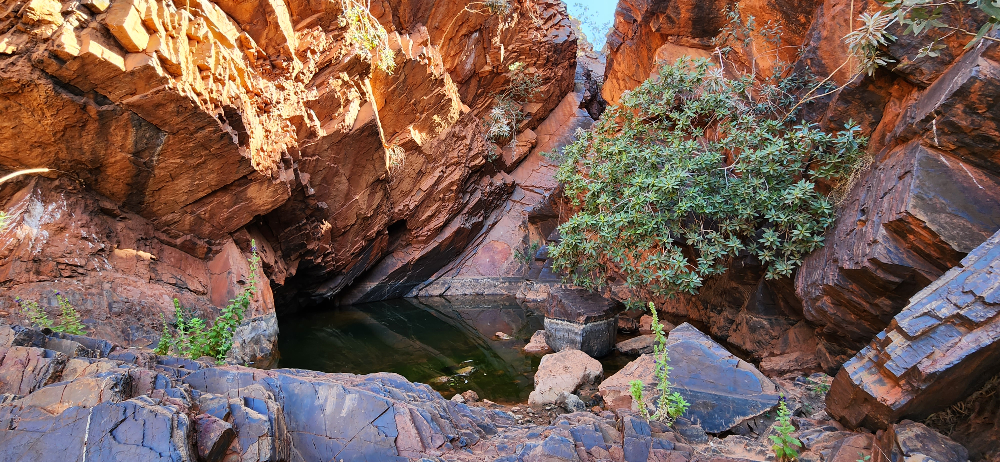
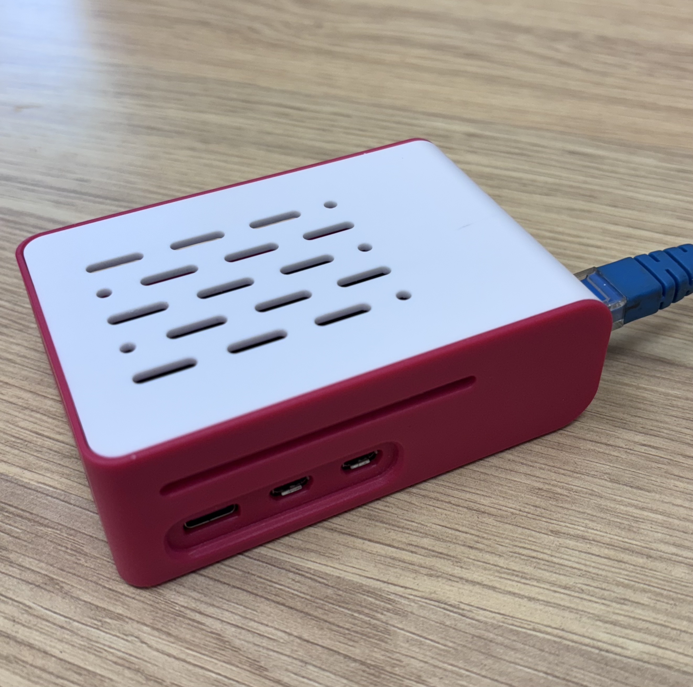
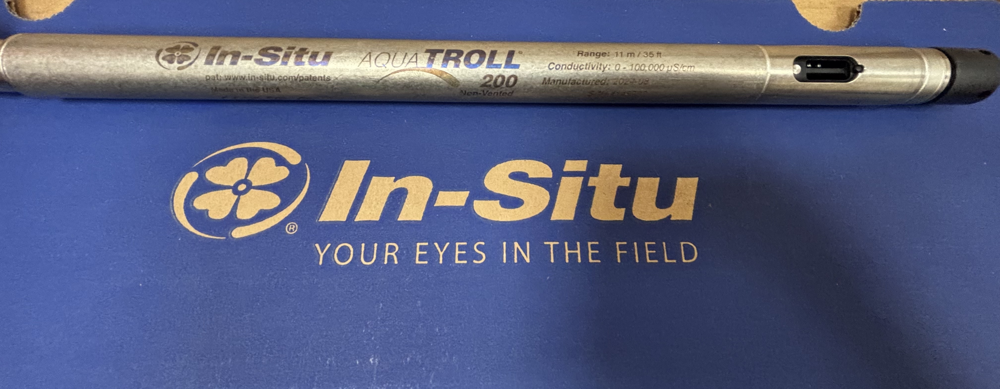

# AquaTroll Logger Data Pipeline

## Project Overview
The industry standard for collecting surface pool depth readings largely relies on pressure-based logger data, which requires regular calibration to remain accurate. In areas with challenging terrain and anthropological sensitivities, infrequent site access leads to unreliable data and delayed identification of issues. This situation makes it impossible to reliably deliver the best possible environmental outcomes.

Off-the-shelf telemetry systems were either too bulky, too power-hungry, or lacked the connectivity required to operate in steep gorges of the project environment. To overcome this, [Maxy Engineering](https://maxyengineering.com.au/) developed a highly portable, power-independent logging system capable of transmitting data via 4G/5G or the Iridium satellite network which eliminates the need for regular site visits.

This project links Maxy’s hardware with a software system that automates key processes: fetching raw data, performing daily pressure calibrations using external weather data, and distributing validated results. The calibrated data enables timely review of anomalies and corrective actions. Results are emailed to the site environmental team and formatted for upload into the company’s environmental data storage system. The full pipeline runs autonomously on a Raspberry Pi, providing reliable, continuous monitoring with no manual data handling.

## Hardware Components
<table>
<tr>
<td width="50%" valign="top" align="center">
<strong>Maxy Remote Logging Unit</strong>  

</td>
<td width="50%" valign="top" align="center">
<strong>Headless Pi & AquaTroll200</strong>  

  

</td>
</tr>
</table>
> *To discuss the most suitable setup for your location, contact Maxy Engineering at:*  
> ✉️ **office@MAXYEngineering.com.au**  
> 📞 **0478 221 776**

## How it Works
The main script, `runPipeline.py`, orchestrates the following steps:
1. **Scraping Logger Data (`loggerScraper.py`):** Uses Playwright to automate a web browser and download raw level and barometric pressure CSV files into the `data_downloads/` directory. Merges these two files for each location.
2. **Scraping Weather Data (`weatherStation.py`):** Uses a GET Request and BeautifulSoup to scrape weather website for daily barometric pressure readings.
3. **Data Validation & Calibration (`dataValidation.py`):**
* Reads CSVs from `data_downloads/`.
* Cleans and validates the data (Converts types. Also handles erroneous and missing values).
* Retrieves external barometric data (by calling `weatherStation.py`).
* Merges external weather data with the logger data based on date.
* Calculates an 'adjusted depth' by comparing barometer data from the logger's internal sensor and the external weather station. Uses In-Situ's formula specific to the AquaTroll sensors.
* Consolidates processed data into final output CSV files (`validatedDepthData.csv` and `SWLVLGenericTemplate_greaterPBOPools.csv`) saved in `transformed_data/`.
4. **Emailing Results (`autoEmail.py`):** Sends the generated CSV files as attachments to configured email recipients.
Configuration for site details, email settings, and target URLs is managed through the `.env` file.

## Threshold Calculations
In the data validation process, thresholds have been applied to ensure accurate depth adjustments:
- Minimum depth threshold: 0.3 meters (prevents corrections in very shallow or dry pools).
- Minimum barometric difference threshold: 5 hPa (avoids adjustments due to sensor noise).

Users should verify if there are any local variations between observed logger values and weather station data post deployment. If significant discrepancies are noted (e.g., individual instruments, elevation differences or microclimates), consider modifying these thresholds in `dataValidation.py` and `testsAB.py` to better suit your specific environment. The goal is to align the deployed, field calibrated AquaTroll with the observed weather station hPa value.

## Quality Assurance and Testing
To maintain data integrity, the project includes A/B tests implemented in `testsAB.py`. These tests validate:
- Connectivity to data sources
- Data structure consistency
- Calculation accuracy
- Site Availability
- Statistical anomaly detection (flagging depth changes >15% and pressure changes >2%)

The tests generate an HTML report (`abTestsReport.html`) summarising results. It is automatically generated whenever runPipeline.py is executed and saves results in the transformed_data folder.
